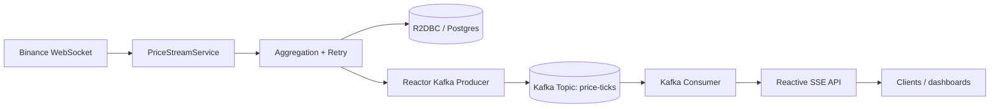

# Kotlin Market Scanner

A reactive market-data scanner built in Kotlin to explore event-driven architecture, Spring WebFlux, R2DBC, and Reactor Kafka in a way that reflects real trading/fintech systems.

## Architecture overview



At a high level, inbound trade events are ingested from a live market feed, normalized into `PriceTick`, aggregated into time windows, and then persisted or forwarded to Kafka. The API layer exposes both a direct SSE endpoint and a paginated query endpoint backed by reactive persistence.

## Key technical decisions

- Kotlin + Spring Boot WebFlux
  - WebFlux gives us non-blocking HTTP and SSE streaming with idiomatic Reactor types.
  - `Flux` is the correct choice for continuously flowing price events; `Mono` is used for single-value operations like fetching one price or persisting one record.

- `PriceTick` as the domain model
  - The price is non-null because a valid market tick must have a numeric price to compare or aggregate.
  - `source` and `volume` are nullable because upstream vendors may omit them or treat them as optional metadata.

- Retry/backoff around the Binance websocket
  - Temporary disconnects are normal in market-data pipelines. `retryWhen(Retry.backoff(...))` makes the stream resilient without masking permanent failures.

- R2DBC instead of blocking JDBC
  - The persistence layer stays non-blocking from ingestion to query, which is essential in a reactive pipeline. A blocking JDBC call would break the event-loop model and add thread starvation risk.

- Reactor Kafka as the durable boundary
  - Kafka acts as a durable, decoupled transport between ingestion and downstream consumers.
  - This differs from a `@KafkaListener` pattern because the code stays fully reactive and composable with existing Reactor pipelines instead of relying on imperative listener callbacks.

## What would be different in production

- Schema evolution with Flyway/Liquibase for migrations.
- More robust observability: Micrometer metrics, distributed tracing, structured logs, and alerting on lag/retries.
- Partitioning strategy for Kafka based on symbol and throughput.
- More careful retry/backoff tuning and dead-letter handling for unparseable or poison records.
- Input validation and circuit breakers for third-party services.
- Multi-instance deployment with horizontal scaling and a shared backing store.

## StepVerifier coverage

The project includes StepVerifier-based assertions for the core reactive chains:

- aggregation + retry recovery in `PriceStreamServiceTest`
- repository pagination and persistence in `PriceTickRepositoryTest`
- Kafka producer/consumer round-trip in `PriceKafkaFlowTest`

These tests validate the real reactive behavior instead of asserting on final-state snapshots alone.

## Interview talking points

In a 2–3 minute explanation, I would say:

1. This project models a real-time market-data pipeline instead of a CRUD app.
2. It ingests a continuous feed, normalizes it into a domain model, and applies backpressure-aware reactive operators.
3. It uses WebFlux for HTTP/SSE, R2DBC for non-blocking persistence, and Kafka for durable async distribution.
4. The project is intentionally designed around failure recovery and stream continuity, which is a common challenge in trading infrastructure.
5. The key lesson is not just “Kotlin works,” but “reactive systems can keep latency low while still handling retry, persistence, and downstream fan-out safely.”

## Local run

```bash
./gradlew test
./gradlew bootJar

docker compose up --build
```

The default application profile is test-friendly and can run without Kafka unless `KAFKA_ENABLED=true` is set in the environment or Docker stack.
